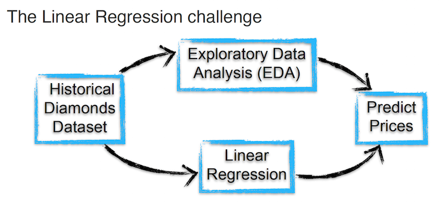

##### *Data Analytics Bootcamp* – Mini Project
##### October 2021

<br>

## The Linear Regression Challenge: Diamonds Price Prediction 💎🏷🤑

Authors:

* **Natália Mendes Ceoldo** ▫︎ [GitHub](https://github.com/natmceoldo) ▫︎ [LinkedIn](https://www.linkedin.com/in/natmceoldo/)

* **Felipe Altermann** ▫︎ [GitHub](https://github.com/fealt) ▫︎ [LinkedIn](https://www.linkedin.com/in/felipealtermann/)

<br>

<br>

## Project Documentation
- [Project Description](#project-description)
- [Metrics](#metrics)
- [Conclusion](#conclusion)
- [Deliverable files in this repository](#deliverables)
- [Tech](#tech)
- [Data source](#data_source)


<a name="project-description"></a>

## Project Description

* Work with data to understand the characteristics of a diamond which are most likely to influence its price.

* Rick – *our client* – has 5,000 diamonds and asked us to estimate their price based on a historic dataset with over 54,000 diamond prices.



<a name="metrics"></a>

## Metrics

**The metric of success is, of course, money** 💲💰💲💰💲

* Our assignment is to estimate the price of Rick’s 5,000 diamonds achieving the smallest amount of error, so he can sell them properly.

* We will specifically measure the **root mean squared error (RMSE)** of our predictions.

* Rick’s goal is to obtain an average error **below 900 dollars**.

<br>


<a name="conclusion"></a>

## Conclusion

The price of a diamond has a direct correlation with its carat. It is not a straight linear correlation but an exponential one. There are other relevant features which also influence its price, such as color, clarity and cut.

* Diamonds Analysis 01
   - Our first approach was to predict the price applying a separate regression model for each color grade with carat weight, clarity grade and cut grade as independent variables. With this method we achieved a root **mean squared error (RMSE)** result of **979.66** USD, almost beating the goal. `File: Diamonds_Analysis_01_A.ipynb`
   - Then we improved the model with clustering to create a new variable based on the diamond's carat weight: either belonging to the first 3 quartiles or not. We got a slightly better result with a **RMSE** of **967.38** USD. `File: Diamonds_Analysis_01_B.ipynb`

* Diamonds Analysis 02
   - On our second approach we switched the way we used color and clarity, creating a regression model for each clarity grade, with color as an independent variable along with carat and cut. With this second approach we got our best **RMSE** result of **791.55** USD. `File: Diamonds_Analysis_02_A.ipynb`
   - Then we tried the same strategy used before but the results were worsened, reaching a **RMSE** of **1,213.73** USD. `File: Diamonds_Analysis_02_B.ipynb`

We did not try the approach of using a different regression model for each cut grade because the graphic analysis of the scatterplot showed a more spread out distribution than the clarity and color ones.

**We conclude that the order of the 4Cs which most influences diamond prices is:**
   1. **Carat**
   2. **Clarity**
   3. **Color**
   4. **Cut**

<br>

```

Note: we always got lower values calculating the RMSE with the historic data compared to the
Rick's dataset because the model is biased with its own original data.

```

<br>

> ❝
> 
> **And *voilà***
>
> We managed to make Rick ` 💰💎💰 richer 💰💎💰 `
>
> Rick's goal was 💲**900** and we got 💲**791**
>
> a **profit increase** of around **➕14%**
>
> 🥳 🥂 🍾
>
> ❞

<br>

<br>


<a name="deliverables"></a>

## Deliverables in this repository

* A *.csv* file containing the data related to the 5,000 diamonds and a new column named *'price_predicted'* with the predictions from our *linear regression model*.
* Upload the *.csv* file to this [LINK](https://daft-oct2020-rick-diamonds.herokuapp.com/) – the web site will calculate the root mean squared error (RMSE) based on its own algorithms.

* Rick cleaned final datasets (./final_csv):
   - `Diamonds_Analysis_01_A.csv`
   - `Diamonds_Analysis_01_B.csv`
   - `Diamonds_Analysis_02_A.csv`
   - `Diamonds_Analysis_02_B.csv`

* Data analysis in Jupyter Notebook:
   - `Diamonds_Analysis_01_A.ipynb`
   - `Diamonds_Analysis_01_B.ipynb`
   - `Diamonds_Analysis_02_A.ipynb`
   - `Diamonds_Analysis_02_B.ipynb`

* Images with the resulted analysis after checked by the above mentioned website:
   - `Rick_Predicted_01_A.png`
   - `Rick_Predicted_01_B.png`
   - `Rick_Predicted_02_A.png`
   - `Rick_Predicted_02_B.png`

<br>


<a name="tech"></a>

## Tech

   - Python @ Jupyter Notebook
   - Pandas / Numpy
   - Matplotlib / Seaborn
   - Sklearn (LinearRegression / mean_squared_error)

<br>


<a name="data_source"></a>

## Data source

  - Rick's Dataset in .csv format (5,000 rows and 10 different columns) named *rick_diamonds.csv* (./data). 

  - Dataset with historic diamonds prices in .csv format (~49,000 rows and 11 different columns) named *hist_diamonds.csv* (./data).

<br>

<br>
